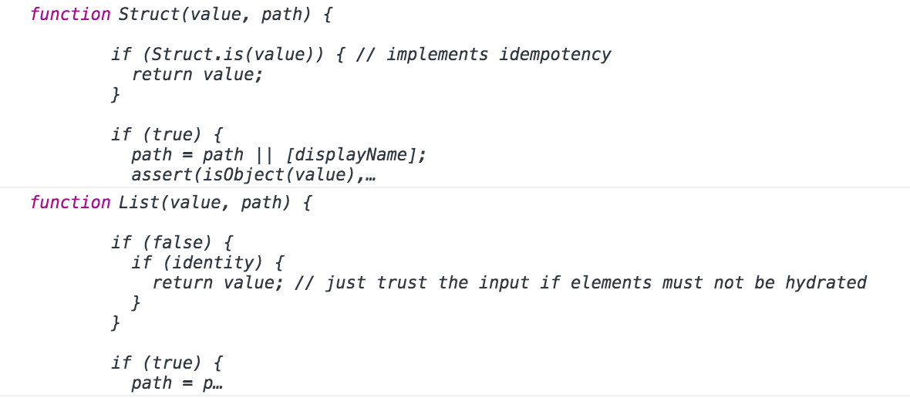

# The idea

What's a type? In tcomb **a type is represented by a function** `T` such that:

1. has signature `T(value)` where value depends on the nature of `T`
2. is idempotent, that is `T(T(value)) = T(value)`
3. owns a static function `T.is(x)` returning `true` if `x` is an instance of `T`

# The `meta` object

Every type defined with `tcomb` owns a static `meta` member containing at least the following properties:

- `kind` an enum containing the type kind (`'irreducible'`, `'struct'`, etc...)
- `name` an optional string, useful for debugging purposes
- `identity` a boolean, `true` if the type can be treated as the identity function in production builds

See the documentation of each combinator for specific additional properties.

**Note**. Meta objects are a distinctive feature of tcomb, allowing **runtime type introspection**.

# The `assert` function

**Signature**

```js
(guard: boolean, message?: string | () => string) => void
```

**Example**

```js
const x = 0;
t.assert(x !== 0, 'cannot divide by x'); // => throws '[tcomb] cannot divide by x'
```

# The `fail` function

**Signature**

```js
(message: string) => void
```

**Note**. You can change the default behaviour when an assert fails overriding the `t.fail` function.

# The built-in types

- `t.String`: strings
- `t.Number`: numbers
- `t.Integer`: integers
- `t.Boolean`: booleans
- `t.Array`: arrays
- `t.Object`: plain objects
- `t.Function`: functions
- `t.Error`: errors
- `t.RegExp`: regular expressions
- `t.Date`: dates
- `t.Nil`: `null` or `undefined`
- `t.Any`: any value
- `t.Type`: a `tcomb` type

# The `irreducible` combinator

**Signature**

```js
(name: string, predicate: (x: any) => boolean) => TcombType
```

**Example**. Representing a native `Promise`:

```js
const PromiseType = t.irreducible('PromiseType', (x) => x instanceof Promise);
```

**The `meta` object**

```js
{
  kind: 'irreducible',
  name: name,
  identity: true,
  predicate: predicate
}
```

**Note**. All the built-in types exported by `tcomb` are defined through the `irreducible` combinator.

# The `refinement` combinator

**Signature**

```js
(type: tcombType, predicate: (x: any) => boolean, name?: string) => TcombType
```

**Example**. Representing a positive number:

```js
const Positive = t.refinement(t.Number, (n) => n >= 0, 'Positive');
```

**The `meta` object**

```js
{
  kind: 'subtype',
  name: name,
  identity: ...depends on type,
  type: type,
  predicate: predicate
}
```

# The `enums` combinator

**Signature**

```js
(map: Object, name?: string) => TcombType
```

where `map` is a hash whose keys are the enums (values are free).

**Example**

```js
const Country = t.enums({
  IT: 'Italy',
  US: 'United States'
}, 'Country');
```

**The `meta` object**

```js
{
  kind: 'enums',
  name: name,
  identity: true,
  map: map
}
```

## The `of` static function

If you don't care of values you can use `enums.of`:

```js
(keys: string | Array<string | number>, name?: string) => TcombType
```

where `keys` is the array of enums or a string where the enums are separated by spaces.

**Example**

```js
// values will mirror the keys
const Country = t.enums.of('IT US', 'Country');

// same as
const Country = t.enums.of(['IT', 'US'], 'Country');

// same as
const Country = t.enums({
  IT: 'IT',
  US: 'US'
}, 'Country');
```

# The `maybe` combinator

In `tcomb` optional values of type `T` can be represented by `union([Nil, T])`. Since it's very common to handle optional values, `tcomb` provide an ad-hoc combinator.

**Signature**

```js
(type: tcombType, name?: string) => TcombType
```

**Example**

```js
const Person = t.struct({
  name: t.String,
  age: t.maybe(t.Number) // an optional number
});

Person({ name: 'Giulio' }); // => ok
Person({ name: 'Giulio', age: null }); // => ok
Person({ name: 'Giulio', age: undefined }); // => ok
Person({ name: 'Giulio', age: 'a string' }); // => throws
```

**The `meta` object**

```js
{
  kind: 'maybe',
  name: name,
  identity: ...depends on type,
  type: type
}
```

# The `struct` combinator

**Signature**

```js
type Options = {
  name?: string,
  strict?: boolean,
  defaultProps?: Object
};

(props: {[key: string]: TcombType;}, options?: string | Options) => TcombType
```

**Example**

```js
const Point = t.struct({
  x: t.Number,
  y: t.Number
}, 'Point');

// point is immutable, the new keyword is optional
const point = Point({ x: 1, y: 2 });
```

**Note**. `Point.is` internally uses `instanceof`.

**The `meta` object**

```js
{
  kind: 'struct',
  name: options.name,
  identity: false,
  props: props,
  strict: options.strict,
  defaultProps: options.defaultProps
}
```

## Strictness

If `strict = true` then no additional props are allowed:

```js
const Point = t.struct({
  x: t.Number,
  y: t.Number
}, 'Point');

Point({ x: 1, y: 2, z: 3 }); // => ok

const Point = t.struct({
  x: t.Number,
  y: t.Number
}, { name: 'Point', strict: true });

Point({ x: 1, y: 2, z: 3 }); // => throws '[tcomb] Invalid additional prop "z" supplied to Point'
```

## Defining methods on a struct

Methods are defined as usual:

```js
Point.prototype.toString = function () {
  return `(${this.x}, ${this.y})`;
};
```

## Extending structs

Every struct constructor owns an `extend` function:

```js
type Props = {[key: String]: Type};
type Mixin = Props | TcombStruct | TcombInterface | refinement(Mixin);
type Options = {
  name?: string,
  strict?: boolean,
  defaultProps?: Object
};

extend(mixins: Mixin | Array<Mixin>, options?: : string | Options) => TcombStruct
```

**Example**

```js
const Point3D = Point.extend({ z: t.Number }, 'Point3D');

// multiple inheritance
const A = struct({...});
const B = struct({...});
const MixinC = {...};
const MixinD = {...};
const E = A.extend([B, MixinC, MixinD]);
```

**Note**. `extend` supports **prototypal inheritance**:

```js
const Rectangle = t.struct({
  width: t.Number,
  height: t.Number
});

Rectangle.prototype.getArea = function () {
  return this.width * this.height;
};

const Cube = Rectangle.extend({
  thickness: t.Number
});

// typeof Cube.prototype.getArea === 'function'
Cube.prototype.getVolume = function () {
  return this.getArea() * this.thickness;
};
```

**Note**. Repeated props are not allowed (unless they are strictly equal):

```js
const Wrong = Point.extend({ x: t.String }); // => throws '[tcomb] Invalid call to mixin(target, source, [overwrite]): cannot overwrite property "x" of target object'
```

Alternatively you can use the `t.struct.extend(mixins: Array<Mixin>, options?: string | Options) => TcombType` function:

```js
const Point3D = t.struct.extend([Point, { z: t.Number }], 'Point3D');
```

**Note**. Repeated defaultProps overwrite previously set values:

```js
const Base = t.struct(
  { value: t.String },
  { defaultProps: { value: "base" }}
);
const Extended = Base.extend(
  {},
  { defaultProps: { value: "override-extended" }}
);
const DeepExtended = t.struct.extend(
  [Base, Extended, {}],
  { defaultProps: { value: "override-deep" }}
);

Base({}).value;          // equals 'base'
Extended({}).value;      // equals 'override-extended'
DeepExtended({}).value;  // equals 'override-deep'
```

**Note**. The implementation uses the top level function `extend(combinator, mixins, options)` defined in `tcomb/lib/extend`

# The `tuple` combinator

**Signature**

```js
(types: Array<TcombType>, name?: string) => TcombType
```

**Note**. Instances of tuples are plain old JavaScript arrays.

**Example**

```js
const Area = t.tuple([t.Number, t.Number]);

// area is immutable
const area = Area([1, 2]);
```

**The `meta` object**

```js
{
  kind: 'tuple',
  name: name,
  identity: ...depends on types,
  types: types
}
```

# The `list` combinator

**Signature**

```js
(type: TcombType, name?: string) => TcombType
```

**Note**. Instances of lists are plain old JavaScript arrays.

**Example**

```js
const Path = t.list(Point);

// path is immutable
const path = Path([
  {x: 0, y: 0}, // tcomb automatically hydrates using the `Point` constructor
  {x: 1, y: 1}
]);
```

**The `meta` object**

```js
{
  kind: 'list',
  name: name,
  identity: ...depends on type,
  type: type
}
```

# The `dict` combinator

**Signature**

```js
(domain: TcombType, codomain: TcombType, name?: string) => TcombType
```

**Note**. Instances of dicts are plain old JavaScript objects.

**Example**

```js
const Phones = t.dict(t.String, t.Number);

// phones is immutable
const phones = Tel({ 'jack': 4098, 'sape': 4139 });
```

**The `meta` object**

```js
{
  kind: 'dict',
  name: name,
  identity: ..depends on domain and codomain,
  domain: domain,
  codomain: codomain
}
```

# The `union` combinator

**Signature**

```js
(types: Array<TcombType>, name?: string) => TcombType
```

**Example**

```js
const IncrementAction = t.struct({ step: t.Number });
const DecrementAction = t.struct({ step: t.Number });
const Actions = t.union([IncrementAction, DecrementAction])
```

**The `meta` object**

```js
{
  kind: 'union',
  name: name,
  identity: ...depends on types,
  types: types
}
```

## The `dispatch` function

In order to use a union **as a constructor** you must implement the `dispatch` static function:

```js
(x: any) => TcombType
```

**Example**

```js
Actions.dispatch = function dispatch(x) {
  const typeToConstructor = {
    'increment': IncrementAction,
    'decrement': DecrementAction
  };
  return typeToConstructor[x.type];
};

const incrementAction = Action({ type: 'increment', step: 1 });
```

**Note**. `tcomb` provides a default implementation of `dispatch` which you can override.

# The `intersection` combinator

**Signature**

```js
(types: Array<TcombType>, name?: string) => TcombType
```

**Example**

```js
const Min = t.refinement(t.String, (s) => s.length > 2);
const Max = t.refinement(t.String, (s) => s.length < 5);
const MinMax = t.intersection([Min, Max]);

MinMax.is('abc');   // => true
MinMax.is('a');     // => false
MinMax.is('abcde'); // => false
```

**The `meta` object**

```js
{
  kind: 'intersection',
  name: name,
  identity: ...depends on types,
  types: types
}
```

# The `interface` combinator

There is an alias (`inter`) for IE8 compatibility.

**Differences from structs**

- `is` doesn't leverage `instanceof`, structural typing is used instead
- doesn't filter additional props
- also checks prototype keys

**Signature**

```js
type Options = {
  name?: string,
  strict?: boolean
};

(props: {[key: string]: TcombType;}, options?: string | Options) => TcombType
```

**Example**

```js
const Foo = t.interface({
  x: t.Number,
  y: t.Number
}, 'Foo');

var foo = Foo({ x: 1, y: 2 }); // => { x: 1, y: 2 }
foo instanceof Foo; // => false (it's a pojo)
Foo.is({ x: 1, y: 2 }); // => true

// allows additional props
Foo.is({ x: 1, y: 2, z: 3 }); // => true

// checks types
Foo.is({ x: 1, y: '2' }); // => false

// doesn't allow missing props
Foo.is({ x: 1 }); // => false

const Point = t.struct({
  x: t.Number,
  y: t.Number
}, 'Point');

const Bar = t.interface({
  point: Point
}, 'Bar');

// hydrates prop values
const bar = Bar({ point: {x: 0, y: 0} });
Point.is(bar.point); // => true

const Serializable = t.interface({
  serialize: t.Function
})

Point.prototype.serialize = function () {
  ...
};

function doSerialize(serializable: Serializable) {
  ...
}

doSerialize(bar.point); // => ok
```

**The `meta` object**

```js
{
  kind: 'interface',
  name: options.name,
  identity: ...depends on props,
  props: props,
  strict: options.strict
}
```

## Strictness

If `strict = true` then no additional props or prototype keys are allowed:

```js
Foo({ x: 1, y: 2, z: 3 }); // => ok

const Foo = t.interface({
  x: t.Number,
  y: t.Number
}, { name: 'Foo', strict: true });

Foo({ x: 1, y: 2, z: 3 }); // => throws '[tcomb] Invalid additional prop "z" supplied to Foo'

Foo(new Point({ x: 1, y: 2 })); // => throws '[tcomb] Invalid additional prop "serialize" supplied to Foo'
```

## Extending interfaces

Every interface constructor owns an `extend` function:

```js
type Props = {[key: String]: Type};
type Mixin = Props | TcombStruct | TcombInterface | refinement(Mixin);
type Options = {
  name?: string,
  strict?: boolean
};

extend(mixins: Mixin | Array<Mixin>, options?: string | Options) => TcombStruct
```

**Example**

```js
const Point3D = Point.extend({ z: t.Number }, 'Point3D');

// multiple inheritance
const A = interface({...});
const B = struct({...});
const MixinC = {...};
const MixinD = {...};
const E = A.extend([B, MixinC, MixinD]);
```

**Note**. Repeated props are not allowed (unless they are strictly equal):

```js
const Wrong = Point.extend({ x: t.String }); // => throws '[tcomb] Invalid call to mixin(target, source, [overwrite]): cannot overwrite property "x" of target object'
```

Alternatively you can use the `t.interface.extend(mixins: Array<Mixin>, options?: string | Options) => TcombType` function:

```js
const Point3D = t.interface.extend([Point, { z: t.Number }], 'Point3D');
```

**Note**. The implementation uses the top level function `extend(combinator, mixins, options)` defined in `tcomb/lib/extend`

# The `func` combinator

**Signature**

```js
(domain: Array<TcombType>, codomain: TcombType, name?: string) => TcombType
```

**Example**

Typed functions may be defined like this:

```js
// add takes two `t.Number`s and returns a `t.Number`
const add = t.func([t.Number, t.Number], t.Number)
  .of((x, y) => x + y);
```

And used like this:

```js
add("Hello", 2); // Raises error: Invalid `Hello` supplied to `t.Number`
add("Hello");    // Raises error: Invalid `Hello` supplied to `t.Number`

add(1, 2);       // Returns: 3
add(1)(2);       // Returns: 3
```

You can define a typed function using the `func(domain, codomain, name?)` combinator where:

- `domain` is the type of the function's argument (or list of types of the function's arguments)
- `codomain` is the type of the function's return value
- `name`: is an optional string useful for debugging purposes

Returns a function type whose functions have their domain and codomain specified and constrained.

`func` can be used to define function types using native types:

```js
// An `A` takes a `t.String` and returns an `t.Number`
const A = t.func(t.String, t.Number);
```

The domain and codomain can also be specified using types from any combinator including `func`:

```js
// A `B` takes a `Func` (which takes a `t.String` and returns a `t.Number`) and returns a `t.String`.
const B = t.func(t.func(t.String, t.Number), t.String);

// An `ExcitedString` is a `t.String` containing an exclamation mark
const ExcitedString = t.refinement(t.String, (s) => s.indexOf('!') !== -1, 'ExcitedString');

// An `Exciter` takes a `t.String` and returns an `ExcitedString`
const Exciter = t.func(t.String, ExcitedString);
```

Additionally the domain can be expressed as a list of types:

```js
// A `C` takes an `A`, a `B` and a `t.String` and returns a `t.Number`
const C = t.func([A, B, t.String], t.Number);
```

**The `meta` object**

```js
{
  kind: 'func',
  name: name,
  identity: true,
  domain: domain,
  codomain: codomain
}
```

## The `of(f: Function, curried?: boolean)` function

```js
func(A, B).of(f);
```

Returns a function where the domain and codomain are typechecked against the function type.

If the function is passed values which are outside of the domain or returns values which are outside of the codomain it will raise an error:

```js
const simpleQuestionator = Exciter.of((s) => s + '?');
const simpleExciter      = Exciter.of((s) => s + '!');

// Raises error:
// Invalid `Hello?` supplied to `ExcitedString`, insert a valid value for the refinement
simpleQuestionator('Hello');

// Raises error: Invalid `1` supplied to `String`
simpleExciter(1);

// Returns: 'Hello!'
simpleExciter('Hello');
```

The returned function may also be partially applied passing a `curried` additional param:

```js
// We can reasonably suggest that add has the following type signature
// add : t.Number -> t.Number -> t.Number
const add = t.func([t.Number, t.Number], t.Number)
  .of((x, y) => x + y, true);

const addHello = add("Hello"); // As this raises: "Error: Invalid `Hello` supplied to `t.Number`"

const add2 = add(2);
add2(1); // And this returns: 3
```

## The `is(x: any)` function

```js
func(A, B).is(x);
```

Returns `true` if x belongs to the type.

```js
Exciter.is(simpleExciter);      // Returns: true
Exciter.is(simpleQuestionator); // Returns: true

const id = (x) => x;

t.func([t.Number, t.Number], t.Number).is(func([t.Number, t.Number], t.Number).of(id)); // Returns: true
t.func([t.Number, t.Number], t.Number).is(func(t.Number, t.Number).of(id));        // Returns: false
```

## Rules

1. Typed functions' domains are checked when they are called
2. Typed functions' codomains are checked when they return
3. The domain and codomain of a typed function's type is checked when the typed function is passed to a function type (such as when used as an argument in another typed function)

# Recursive types

`t.declare([name])` declares a type name to be used in other combinators without requiring a definition right away. This enables the construction of recursive or mutually recursive types.

```js
const Tree = t.declare('Tree');

Tree.define(t.struct({
  value: t.Number,
  left: t.maybe(Tree),
  right: t.maybe(Tree)
}));

const bst = Tree({
  value: 5,
  left: {
    value: 2
  },
  right: {
    left: {
      value: 6
    },
    value: 7
  }
});
```

```js
const A = t.declare('A');

const B = t.struct({
  a: t.maybe(A)
});

A.define(t.struct({
  b: t.maybe(B)
}));
```

**Warning**. **Do not** try to type-check structures with circular references, that would blow the stack.

**Warning**. If you define a union with a custom `dispatch`, do define the `dispatch` function before calling `define`

```js
const U = t.declare('U')
// good
U.dispatch = (x) => t.String.is(x) ? t.String : U
U.define(t.union([t.String, t.list(U)]))
// bad
// U.dispatch = (x) => t.String.is(x) ? t.String : U
```

# Updating immutable instances

You can update an immutable instance with the provided `update` function:

```js
MyTcombType.update(instance, patch)
```

The following commands are compatible with the [Facebook Immutability Helpers](http://facebook.github.io/react/docs/update.html):

* `$push`
* `$unshift`
* `$splice`
* `$set`
* `$apply`
* `$merge`

Example:

```js
const p = Point({ x: 1, y: 2 });

p = Point.update(p, {x: { '$set': 3 }}); // => { x: 3, y: 2 }
```

**Note**. `$apply` can be used only with shallow cloneable values, i.e. `Object`s, `Array`s and primitive values (counterexample: an instance of `Date` is not shallow cloneable).

**Removing a value from a dict**

```js
const MyType = dict(t.String, t.Number);
const instance = MyType({ a: 1, b: 2 });
const updated = MyType.update(instance, { $remove: ['a'] }); // => { b: 2 }
```

**Swapping two list elements**

```js
const MyType = list(t.Number);
const instance = MyType([1, 2, 3, 4]);
const updated = MyType.update(instance, { '$swap': { from: 1, to: 2 } }); // => [1, 3, 2, 4]
```

**Adding other commands**

You can add your custom commands updating the `t.update.commands` hash.

# Pattern matching, the `match` function

**Signature**

```js
(x: any, ...cases: Array<Case>) => any
```

where each `Case` has the following structure:

```js
type, [guard], block
```

- `type` a tcomb type
- `guard` an optional predicate `(x: any) => any`
- `block` a function `(x: any) => any` called when the match succeeded

**Example**

```js
const A = t.struct({...});

const result = t.match(1,
  t.String, (s) => 'a string',
  t.Number, (n) => n > 2, (n) => 'a number gt 2', // case with a guard (optional)
  t.Number, (n) => 'a number lte 2',
  A,        (a) => 'an instance of A',
  t.Any,    (x) => 'other...' // catch all
);

console.log(result); // => 'a number lte 2'
```

**Note**. If a match is not found an error will be raised.

# Other exported functions

## The `update` function

Immutability helper for POJOs.

**Signature**

```js
update(instance: Object, patch: Object) => Object
```

**Example**

```js
const x = { a: 1 };
t.update(x, { a: { $set: 2 } }); // => { a: 2 }, x is untouched
```

**Note**. You can change the default behaviour overriding the `t.update` function:

```js
t.update = function (instance, patch) {
  // your implementation here
};
```

## The `getTypeName` function

Returns the name of a tcomb type.

**Signature**

```js
(type: TcombType) => string
```

**Example**

```js
t.getTypeName(t.String); // => 'String'
```

If a name is not specified when defining the type, a default name will be provided according to [http://flowtype.org](http://flowtype.org) syntax for type annotations.

```js
t.getTypeName(t.maybe(t.String)); // => ?String
t.getTypeName(t.struct({ name: t.String, surname: t.String })); // => '{name: String, surname: String}'
t.getTypeName(t.union([t.String, t.Number])); // => String | Number
t.getTypeName(t.dict(t.String, t.Number)); // => {[key: String]: Number}
...
```

## The `mixin` function

Safe version of mixin, properties cannot be overwritten.

**Signature**

```js
(target: Object, source: Object, unsafe?: boolean = false) => Object
```

**Example**

```js
t.mixin({ a: 1 }, { b: 2 }); // => { a: 1, b: 2 }
t.mixin({ a: 1 }, { a: 2 }); // => throws
t.mixin({ a: 1 }, { a: 1 }); // => ok
t.mixin({ a: 1 }, { a: 2 }, true); // { a: 2 }
```

## The `stringify` function

Used internally to format the error messages.

**Signature**

```js
(x: any) => String
```

Since by default `JSON.stringify` is used, in a performance intensive application you may want to override it:

```js
// override with a less verbose but much faster function
t.stringify = (x) => x.toString();
```

## The `isType` function

Returns `true` if `x` is a tcomb type.

**Signature**

```js
(x: any) => boolean
```

## The `is` function

Returns `true` if `x` is an instance of `type`.

**Signature**

```js
(x: any, type: TcombType) => boolean
```

# Other modules

## The `lib/fromJSON` module

Generic deserialization function.

**Signature**

```js
(value: any, type: TcombType) => type
```

**Example**

```js
import fromJSON from 'tcomb/lib/fromJSON'

const Person = t.struct({
  name: t.String,
  birthDate: Date
});

const source = {
  name: 'Giulio',
  birthDate: new Date(1973, 10, 30)
};

const json = JSON.parse(JSON.stringify(source));

Person(json); // => throws '[tcomb] Invalid value "1973-11-29T23:00:00.000Z" supplied to Person/birthDate: Date'

const person = fromJSON(json, Person);

assert.ok(person instanceof Person); // => true
assert.deepEqual(person, source); // => ok
```

You can add a static `fromJSON: (jsonValue: any) => any` function to your types as a custom reviver.

## The `lib/installTypeFormatter` module

Chrome Dev Tools custom formatter for tcomb types.

Chrome (v47+) has support for custom "formatters". A formatter tells Chrome's Dev Tools how to display values in the Console, Scope list, etc. This means we can display Structs, Lists, Dicts and other types, in a much better way.

Essentially, it turns this:



into:


**Setup**

```js
import installTypeFormatter from 'tcomb/lib/installTypeFormatter'
installTypeFormatter()
```

## The `lib/isSubsetOf` module

Function for determining whether one type is compatible with another type.

**Signature**

```js
(subset: Type, superset: Type) => boolean
```

**Example**

```js
import t from 'tcomb'
import isSubsetOf from 'tcomb/lib/isSubsetOf';

isSubsetOf(t.Integer, t.Number) // => true

const Point = t.interface({
  x: t.Number,
  y: t.Number
}, 'Point');

const Point3D = t.interface({
  x: t.Number,
  y: t.Number,
  z: t.Number
}, 'Point3D');

isSubsetOf(Point3D, Point) // => true

const StrictPoint = t.interface({
  x: t.Number,
  y: t.Number
}, { name: 'StrictPoint', strict: true });

isSubsetOf(Point3D, StrictPoint) // => false
```