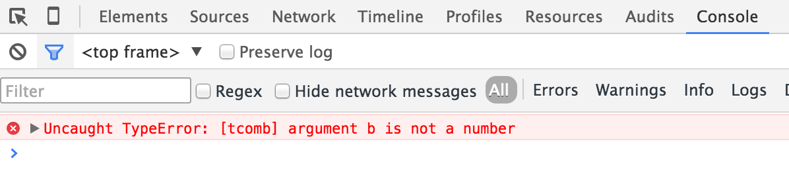
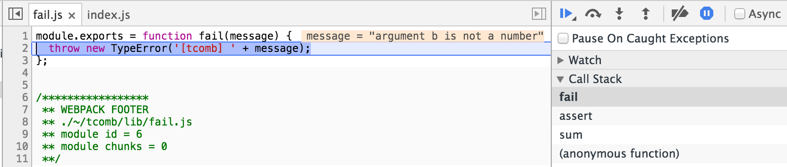
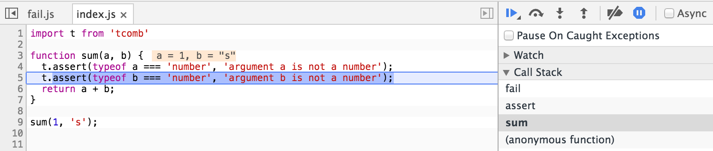
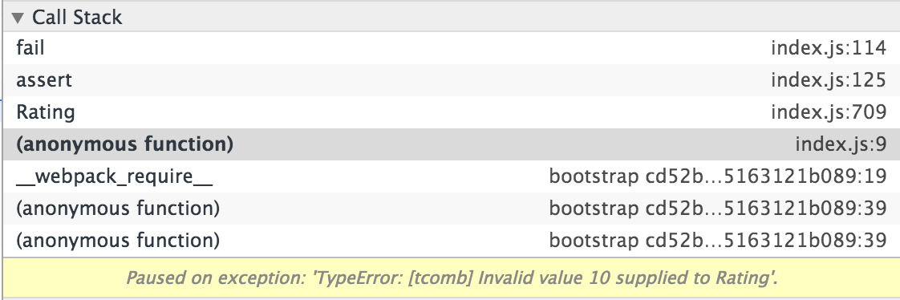
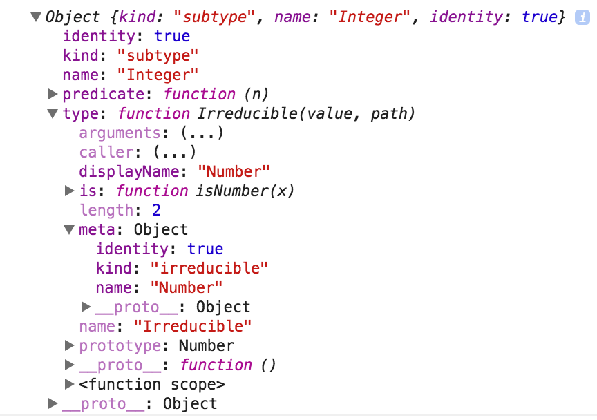
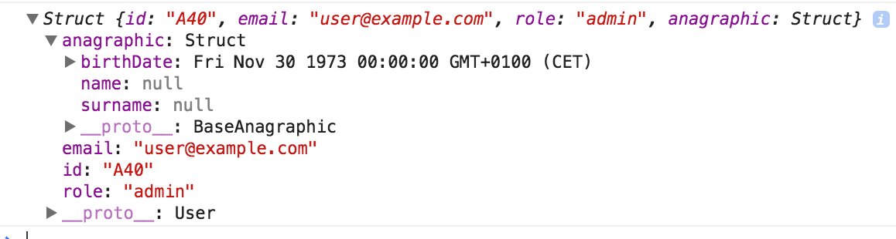

# A little guide to runtime type checking and runtime type introspection (WIP)

Comments and suggestions are welcome, please open an issue [here](https://github.com/gcanti/tcomb) or send a Pull Request.

The examples of this guide use [tcomb](https://github.com/gcanti/tcomb), a library for Node.js and the browser which allows you to check the types of JavaScript values at runtime with a simple and concise syntax. It's great for Domain Driven Design and for adding safety to your internal code.

# Get started: basic type checking

Let's start with a simple task, adding runtime type checking to the following function:

```js
// a, b should be numbers
function sum(a, b) {
  return a + b;
}
```

An easy way to achieve this goal is to add *asserts* (also called *invariants*) to the function.

## The `assert` function

**Signature**

```js
(guard: boolean, message?: string | () => string) => void
```

The `assert` function is the main building block of `tcomb`.

**Example**

```js
import t from 'tcomb';

function sum(a, b) {
  t.assert(typeof a === 'number', 'argument a is not a number');
  t.assert(typeof b === 'number', 'argument b is not a number');
  return a + b;
}
```

**Note**. The assert fails if `guard !== true`.

When an assert fails, the default behavior is throwing a `TypeError`.

```js
sum(1, 's'); // => throws TypeError
```



**Tip**. If you are using the Chrome DevTools, set "Pause on exceptions" on the "Sources" panel in order to leverage the power of the debugger (Watch, Call Stack, Scope, Breakpoints, etc...)



Clicking the "sum" item in the Call Stack shows the offending line of code:



Note that `message` can also be a function so you can define *lazy error messages* (i.e. the function contained in `message` is called only when the assert fails). As a benefit you can get detailed messages without too much overhead (`JSON.stringify` is expensive):

```js
import t from 'tcomb';

function sum(a, b) {
  t.assert(typeof a === 'number', () => `invalid value ${JSON.stringify(a)} supplied to argument a, expected a number`);
  t.assert(typeof b === 'number', () => `invalid value ${JSON.stringify(b)} supplied to argument b, expected a number`);
  return a + b;
}

sum(1, {x: 1}); // throws '[tcomb] invalid value {"x":1} supplied to argument b, expected a number'
```

You can customise the failure behavior overriding the exported `fail` function:

**Signature**

```js
(message: string) => void
```

**Example**

```js
t.fail = function (message) {
  console.error(message);
};

sum(1, 's'); // => outputs to console 'invalid value "s" supplied to argument b, expected a number'
```

## Optimise production builds

> If a tree falls in a forest and no one is around to hear it, does it make a sound?

Asserts are very useful in development but you may want to strip them out in production. Just wrap the asserts in conditional blocks checking the `process.env.NODE_ENV` global variable:

```js
function sum(a, b) {
  if (process.env.NODE_ENV !== 'production') {
    // this code exists and then executes only in development
    t.assert(typeof a === 'number', 'argument a is not a number');
    t.assert(typeof b === 'number', 'argument b is not a number');
  }
  return a + b;
}
```

then use modules like `envify` (for `browserify`) or `webpack.DefinePlugin` (for `webpack`) in your production build.

**TODO**. Example configuration for browserify and webpack.

## Reducing the boilerplate

Writing asserts can be cumbersome, let's see if we can write less. Every type defined with `tcomb`, included the built-in type `t.Number` (the type of all numbers), owns a static predicate `is(x: any) => boolean` useful for type checking:

```js
import t from 'tcomb';

function sum(a, b) {
  t.assert(t.Number.is(a), 'argument a is not a number');
  t.assert(t.Number.is(b), 'argument b is not a number');
  return a + b;
}
```

Still too verbose. Luckily every `tcomb`'s type is a *glorified identity function*, that is it returns the value passed in if is good and throws (but only in development!) otherwise:

```js
function sum(a, b) {
  t.Number(a); // throws if a is not a number
  t.Number(b); // throws if b is not a number
  return a + b;
}

sum(1, 's'); // => throws '[tcomb] Invalid value "s" supplied to Number'
```

The following built-in types are exported by `tcomb`:

- `t.String`: strings
- `t.Number`: numbers
- `t.Boolean`: booleans
- `t.Array`: arrays
- `t.Object`: plain objects
- `t.Function`: functions
- `t.Error`: errors
- `t.RegExp`: regular expressions
- `t.Date`: dates

There are 2 additional built-in types:

- `t.Nil`: `null` or `undefined`
- `t.Any`: any value (useful when you need a temporary placeholder or an escape hatch...)

## The `func` combinator

Another way to type-check the `sum` function is to use the `func` combinator:

**Signature**

```js
(domain: Array<TcombType>, codomain: TcombType, name?: string) => TcombType
```

**Example**

```js
const SumType = t.func([t.Number, t.Number], t.Number);

// of() returns a type-checked version of its argument
const sum = SumType.of((a, b) => a + b);

sum(1, 's'); // => throws '[tcomb] Invalid value "s" supplied to [Number, Number]/1: Number'
```

## Error message format

The string `'Invalid value "s" supplied to [Number, Number]/1: Number'` is an example of the concise format used by `tcomb` in order to point to the offended type. You can read it like this:

> The value of the second element of the tuple [Number, Number] is "s" but a Number was expected

The general format of an error message is:

```js
'Invalid value <value> supplied to <context>'
```

where `<context>` is a slash-separated string with the following properties:

- the first element is the name of the *root* type
- the following elements have the format: `<field name>: <field type>` (arrays are 0-based)

## The babel plugin

If you are using babel, there is another option (the one I personally use the most): adding type annotations and use the [babel-plugin-tcomb](https://github.com/gcanti/babel-plugin-tcomb) plugin.

**Example**

```js
function sum(a: t.Number, b: t.Number) {
  return a + b;
}

sum(1, 's'); // => throws '[tcomb] Invalid value "s" supplied to Number'
```

# User defined types, the `irreducible` combinator

`tcomb` exports the most common types but you can define your own. Say you want to add support for `Map`s, you can use the `irreducible` combinator:

**Signature**

```js
(name: string, predicate: (x: any) => boolean) => TcombType
```

**Example**

```js
const MapType = t.irreducible('MapType', (x) => x instanceof Map);

function size(map) {
  MapType(map);
  return map.size;
}

console.log(size(new Map())); // => 0
console.log(size({})); // throws '[tcomb] Invalid value {} supplied to MapType'
```

**Note**. The built-in types (`t.String`, `t.Number`, etc...) are defined with the `irreducible` combinator.

# Restricting a type, the `refinement` combinator

I can use `t.String` in order to type-check generic strings, but often I want more precise types. Say I want to represent the `Password` type: the type of all strings whose length is greater then `6`:

```js
const Password = t.irreducible('Password', (x) => t.String.is(x) && x.length > 6);
```

This is too verbose, let's use the `refinement` combinator:

**Signature**

```js
(type: tcombType, predicate: (x: any) => boolean, name?: string) => TcombType
```

**Example**

```js
const Password = t.refinement(t.String, (s) => s.length > 6);

Password('short'); // throws '[tcomb] Invalid value "short" supplied to {String | <function1>}'
```

Note that in the predicate `(s) => x.length > 6` I no longer check for strings since the `refinement` combinator automatically handles that for me.

For better error messages, give the type a name:

```js
const Password = t.refinement(t.String, (s) => s.length > 6, 'Password');

Password('short'); // throws '[tcomb] Invalid value "short" supplied to Password'
```

## Chaining refinements

**Example**. Representing an integer between `1` and `5`

```js
const Integer = t.refinement(t.Number, (n) => n % 1 === 0, 'Integer');

const PositiveInteger = t.refinement(Integer, (i) => i > 0, 'PositiveInteger');

const Rating = t.refinement(PositiveInteger, (r) => r <= 5, 'Rating');

Rating(10); // throws '[tcomb] Invalid value 10 supplied to Rating'
```

Note that you can see the name of the failing type and the message in the Call Stack panel:



## A first taste of runtime type introspection

Every type defined with `tcomb` owns a static `meta` member containing at least the following properties:

- `kind` a stringy enum containing the type kind (equal to `'irreducible'` for irreducibles or `'subtype'` for refinements)
- `name` a string, the name of the type
- `identity` a boolean, `true` if the type constructor can be treated as the identity function in production builds

The refinements `meta` object owns an additional property `type` containing its *supertype*:

**Example**

```js
Integer.meta.type === t.Number; // => true
console.log(Integer.meta);
```



We can exploit this information in order to define a function returning the type chain of a refinement:

```js
function getTypeChain(type) {
  const name = type.meta.name;
  const supertype = type.meta.type;
  if (!supertype) {
    // no more supertypes
    return name;
  }
  // recurse
  return [name].concat(getTypeChain(supertype));
}

console.log(getTypeChain(Rating)); // => ["Rating", "PositiveInteger", "Integer", "Number"]
```

# A particular kind of refinement, the `enums` combinator

When a type represent a finite list of strings, instead of a refinement you can use the `enums` combinator:

**Signature**

```js
(map: Object, name?: string) => TcombType
```

where `map` is a hash whose keys are the enums (values are free).

**Example**

```js
const Country = t.enums({
  IT: 'Italy',
  US: 'United States'
}, 'Country');

Country('FR'); // throws '[tcomb] Invalid value "FR" supplied to Country (expected one of ["IT", "US"])'
```

**Example**. Building a select input from an enum

The `meta` object of an enum owns an additional property `map` containing the keys:

```js
JSON.stringify(Country.meta.map); // => {"IT":"Italy","US":"United States"}
```

We can use that map to dinamically generate the options of a select (which will be always in sync with your domain model):

```js
import t from 'tcomb';
import React from 'react';
import { render } from 'react-dom';
import _ from 'lodash';

render(
  <select>
    {_.map(Country.meta.map, (text, value) => <option key={value} value={value}>{text}</option>)}
  </select>,
  document.getElementById('app')
)
```

A more general abstraction:

```js
function isEnums(x) {
  return x && x.meta && x.meta.kind === 'enums';
}

function renderSelect(type) {
  // type checking
  if (process.env.NODE_ENV !== 'production') {
    t.assert(isEnums(type), () => `Invalid argument type ${JSON.stringify(type)} supplied to renderSelect(), expected an enum`);
  }
  return (
    <select>
      {_.map(type.meta.map, (text, value) => <option key={value} value={value}>{text}</option>)}
    </select>
  );
}

renderSelect(); // throws [tcomb] Invalid argument type undefined supplied to renderSelect(), expected an enum
renderSelect(Country); // ok
```

## The `of` static function

If you don't care of values you can use `enums.of`:

**Example**

```js
// values will mirror the keys
const Country = t.enums.of('IT US', 'Country');

// same as
const Country = t.enums.of(['IT', 'US'], 'Country');

// same as
const Country = t.enums({
  IT: 'IT',
  US: 'US'
}, 'Country');
```

# Optional values, the `maybe` combinator

Prolem. So far the values were always required, but what if I must handle optional values?

Solution. There is the `maybe` combinator and it can be composed with every other combinator:

**Signature**

```js
(type: tcombType, name?: string) => TcombType
```

**Example**. An optional country.

```js
t.maybe(Country)(); // ok
t.maybe(Country)(undefined); // ok
t.maybe(Country)(null); // ok
t.maybe(Country)('IT'); // ok
t.maybe(Country)(1); // throws
```

# Classes, the `struct` combinator

Classes are common compound data structures (also called *product* types) thus there is a combinator for them, the `struct` combinator:

**Signature**

```js
(props: {[key: string]: TcombType;}, name?: string) => TcombType
```

**Example**

```js
const Point = t.struct({
  x: t.Number,
  y: t.Number
}, 'Point');

// the keyword new is optional
const point = Point({ x: 1, y: 2 });
```

Methods are defined as usual:

```js
Point.prototype.toString = function() {
  return `(${this.x}, ${this.y})`;
};

console.log(String(point)); // => '(1, 2)'
```

**Example**. The `User` struct.

```js
const emailRegExp = ...long regexp here...

const Email = t.refinement(t.String, (s) => emailRegExp.test(s), 'Email');

const Role = t.enums.of([
  'admin',
  'guest'
], 'Role');

const User = t.struct({
  id: t.String,
  email: Email,
  role: Role,
  birthDate: t.maybe(t.Date),
  name: t.maybe(t.String),
  surname: t.maybe(t.String)
}, 'User');

const user = User({
  id: 'A40',
  email: 'user@example.com',
  role: 'admin',
  name: 'Giulio'
});
```

Generally I prefer flat structures, however structs can be nested:

```js
const Anagraphic = t.struct({
  birthDate: t.maybe(t.Date),
  name: t.maybe(t.String),
  surname: t.maybe(t.String)
}, 'Anagraphic')

const User = t.struct({
  id: t.String,
  email: Email,
  role: Role,
  anagraphic: Anagraphic
}, 'User');

const user = User({
  id: 'A40',
  email: 'user@example.com',
  role: 'admin',
  anagraphic: {
    name: 'Giulio'
  }
});
```

### Refinement can be applied to all types

Problem. What if I want to express the following invariant? "Name and surname are optional, but they must be both null or both valued".

Solution. Define a refinement of `Anagraphic`:

```js
const BaseAnagraphic = t.struct({
  birthDate: t.maybe(t.Date),
  name: t.maybe(t.String),
  surname: t.maybe(t.String)
}, 'BaseAnagraphic');

const Anagraphic = t.refinement(
  BaseAnagraphic,
  (x) => t.Nil.is(x.name) === t.Nil.is(x.surname),
  'Anagraphic'
);

const User = t.struct({
  id: t.String,
  email: Email,
  role: Role,
  anagraphic: Anagraphic
}, 'User');

const user = User({
  id: 'A40',
  email: 'user@example.com',
  role: 'admin',
  anagraphic: {
    name: 'Giulio'
  }
}); // thows tcomb] Invalid value {"name": "Giulio"} supplied to User/anagraphic: Anagraphic

const user = User({
  id: 'A40',
  email: 'user@example.com',
  role: 'admin',
  anagraphic: {
    name: 'Giulio',
    surname: 'Canti'
  }
}); // ok
```

## Runtime type introspection, playing with structs

**Example**. JSON serialisation / deserialisation.

Serialising an instance of `User` is easy, just call `JSON.stringify`:

```js
const user = User({
  id: 'A40',
  email: 'user@example.com',
  role: 'admin',
  anagraphic: {}
});

console.log(JSON.stringify(user));
// => {"id":"A40","email":"user@example.com","role":"admin","anagraphic":{"birthDate":null,"name":null,"surname":null}}
```

Deserialising is easy as well since struct constructors accept an object as argument:

```js
const json = JSON.parse(JSON.stringify(user));
console.log(User(json)); // => a User instance
```

The problem comes when you add a `birthDate` and try to deserialize:

```js
const user = User({
  id: 'A40',
  email: 'user@example.com',
  role: 'admin',
  anagraphic: {
    birthDate: new Date(1973, 10, 30)
  }
});

const json = JSON.parse(JSON.stringify(user));

console.log(User(json));
// throws '[tcomb] Invalid value "1973-11-29T23:00:00.000Z" supplied to User/anagraphic: Anagraphics/birthDate: ?Date'
```

Problem. `'1973-11-29T23:00:00.000Z'` is a string but `Anagraphics` wants a `Date`.

Solution. Use runtime type introspection to define a general reviver.

**Disclaimer**. This is just an example, it doesn't mean to be complete (for a complete implementation see the `lib/fromJSON` module).

```js
import _ from 'lodash';

function deserialize(value, type) {
  if (t.Function.is(type.fromJSON)) {
    return type.fromJSON(value);
  }
  const { kind } = type.meta;
  switch (kind) {
    case 'struct' :
      return type(_.mapValues(value, (v, k) => deserialize(v, type.meta.props[k])));
    case 'maybe' :
      return t.Nil.is(value) ? null : deserialize(value, type.meta.type);
    case 'subtype' : // the kind of refinement is 'subtype' (for legacy reasons)
      return deserialize(value, type.meta.type);
    default : // enums, irreducible
      return value;
  }
}

// then configure your types
t.Date.fromJSON = (s) => new Date(s);

console.log(deserialize(json, User)); // => see the image below
```



**Note**. `tcomb` is able to deserialize the nested structs: the value of the field `anagraphic` is an instance of `BaseAnagraphic`.

# Keep the domain model DRY

In order to keep my domain model DRY I use a few techniques:

## 1. Defining granular types

Say you want to define a `User` as a struct with the following fields:

- email
- name
- surname

```js
import t from 'tcomb'

export default t.struct({
  email: t.refinement(t.String, (s) => /@/.test(s), 'Email'),
  name: t.String,
  surname: t.String
}, 'User')
```

The problem is that you can't re-utilize the `email` type as it's coupled with the `User` type. A quick solution is to split the definitions:

```js
// file Email.js
import t from 'tcomb'

export default t.refinement(t.String, (s) => /@/.test(s), 'Email')

...

// file User.js
import t from 'tcomb'
import Email from './Email'

export default t.struct({
  email: Email,
  name: t.String,
  surname: t.String
}, 'User')
```

## 2. Extending a type

When 2 structs share a subset of their fields you can use [mixins](https://github.com/gcanti/tcomb/blob/master/docs/API.md#extending-a-struct):

```js
// file IdentifiedUser.js
import User from './User'

// every field of User plus an id
export default User.extends({ id: t.String }, 'IdentifiedUser')
```

## 3. Narrowing down the type and/or automatically sync using runtime type introspection

All `tcomb`'s types are introspectables at runtime (see the `meta` object in the [docs](https://github.com/gcanti/tcomb/blob/master/docs/API.md#the-struct-combinator))

```js
// file Message.js
import User from './User'

export default t.struct({
  email: User.meta.props.email, // automatically synced
  message: t.String
}, 'Message')
```
